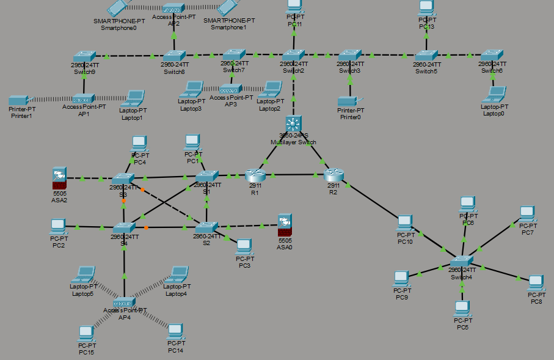

# Enterprise Network Design (Cisco Packet Tracer)

# Network Implementation, Optimization, and Maintenance for PTC Inc.

**Author:** Sahil Faraz | **Date:** February 2025

## 🎯 Objective
This project aims to design, implement, and maintain a robust network infrastructure for PTC Inc., ensuring scalability, security, and high performance through optimized configurations, security measures, and proactive monitoring. This was developed and implemented as a part of a Networking Assignment.

---

## 🏗️ Network Design & Architecture

The network utilizes a **Star Topology** for easy management and high availability. It is built using Cisco routers, switches, and firewalls, with a comprehensive IP addressing plan utilizing subnetting for both IPv4 and IPv6.

### Key Components
* **Routers:** Configured for inter-VLAN routing, OSPF/BGP, and failover mechanisms.
* **Switches:** Implemented Layer 3 routing with VLAN segmentation.
* **Firewalls:** Set up with Access Control Lists (ACLs), Deep Packet Inspection, and Security Rules.
* **Access Points (APs):** Configured with Wi-Fi 6 for high-speed wireless networking.
* **Servers:** DNS, DHCP, File Storage, and VoIP servers for seamless internal communication.

### VLAN Segmentation & IP Addressing
| VLAN Name | Subnet | Purpose |
| :--- | :--- | :--- |
| **Management** | `192.168.10.0/24` | IT and Network Administration |
| **Employee Workstations** | `192.168.30.0/24` | General Office Use |
| **Guest Network** | `192.168.40.0/24` | Isolated for security |
| **VoIP** | `192.168.50.0/24` | Prioritized for voice traffic|
| **Security** | `192.168.60.0/24` | CCTV, Security Logs, Access Control |

---

## 🛡️ Security & Performance Measures

* **Access & Authentication:** Multi-Factor Authentication (MFA) enforced for VPN/remote access, and role-based access control policies for employees and external users.
* **Encryption:** SSL/TLS and IPsec utilized for secure data transmission.
* **Threat Mitigation:** Firewalls and IDS/IPS deployed to monitor suspicious activity and block unauthorized access.
* **Redundancy:** Configured with dual ISPs and redundant network paths for failover.
* **Testing:** Verified through Ping, Traceroute, SSH connectivity, and bandwidth/QoS testing.

---

## 🛠️ Maintenance & Future Roadmap

### Scheduled Maintenance Plan
| Task | Frequency | Purpose |
| :--- | :--- | :--- |
| **Device Health Check** | Monthly | Ensure routers, switches, and APs function correctly. |
| **Firmware Updates** | Quarterly | Apply security patches and performance updates. |
| **Security Audits** | Quarterly | Conduct vulnerability assessments and penetration testing.|
| **Performance Analysis** | Bi-Annually | Optimize network traffic and bandwidth usage. |
| **Scalability Review** | Annually | Plan for future expansion and equipment upgrades. |

### Future Enhancements
* Upgrade to Wi-Fi 7 for faster wireless connectivity.
* Implement AI-based network monitoring for real-time threat detection.
* Adopt IPv6-only infrastructure for long-term scalability.
* Enhance cloud integration for improved remote access and collaboration.

---

## 🚀 How to Open & Run the Simulation

To view the device configurations and active simulations, follow these steps:

1. Download and install **Cisco Packet Tracer**.
2. Open the application and navigate to `File → Open`.
3. Select the `PTC Inc.pkt` file included in this repository.
4. You can use the CLI on the routers and switches to analyze configurations.

**Testing Instructions:**
* Use Ping (ICMP) commands to verify device connectivity.
* Run Traceroute to check packet forwarding paths.
* Test firewall rules and ACLs by attempting blocked and allowed connections.
* Monitor traffic flow & QoS policies for optimized bandwidth allocation.

---
*This Packet Tracer simulation reflects real-world networking principles, allowing for further analysis and improvement.*
